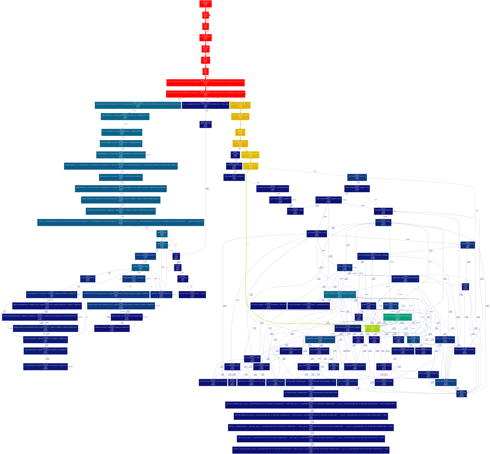

# Exercice 2

## Schema VALGRIND initial

Durée du rendu pour two triangles on a sphere (480x270) : 
    hors callgrind : 0.093 seconds
    in callgrind : 4.279 seconds

## Listes de optimisations

### Optimisation 1

- Retrait de code inutile (count_prism on Sphere.cpp)

### Optimisation 2

- Passage de racines carrées a des puissances de 2 (sqrt -> pow(2, 0.5))
- Passage de divisions a des multiplications (1 / x -> x^-1) 

### Optimisation 3

- Focus sur les fonction indiquées par callgrind 
Normalize :  calcul via l'inverse

## Après optimisations

Temps de rendu pour two triangles on a sphere (480x270) : 
    hors callgrind : 0.089 seconds
    in callgrind : 4.249 seconds